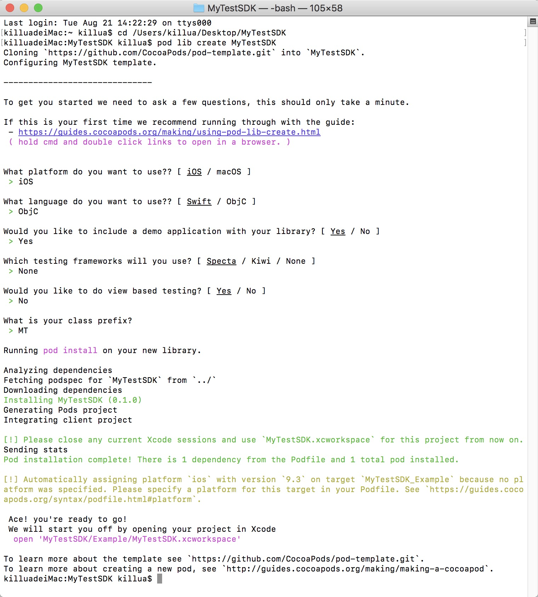
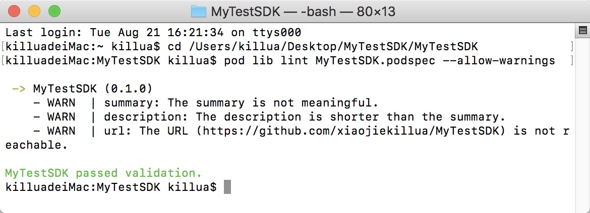

# 使用cocoapods打包静态库

--

**1. 新建lib工程**

`相关命令:`

		cd /Users/killua/Desktop/MyTestSDK
		pod lib create MyTestSDK
		
**2. 配置podspec文件，添加SDK代码**

> [**podspec 样本 (xcode打开)**](MyTestSDK.podspec)

`添加SDK代码:`

		1.将相关SDK代码拖到lib工程Finder目录下(无需拖入工程中)
		2.spec配置中s.source + s.source_files路径会找到相关SDK代码
		

`spec主要配置说明:`

		1. s.version
			版本号，最终打包前打tag步骤中的版本号要与该版本号一致(往后每次更新spec文件或修改相关SDK代码都需要更新version及重新打tag)
		2. s.source
			资源路径，最终打包会跟随spec索引中该标识寻找相关源码(可以提供远端仓库路径https://github.com/xiaojiekillua/MyTestSDK.git  或者本地路径 /Users/killua/Desktop/MyTestSDK/MyTestSDK)
		3. s.source_files
			相关SDK代码存放路径
		4. public_header_files
			公开头文件路径
		5. s.frameworks
			系统相关依赖 如：CFNetwork
		6. s.dependency
			第三方依赖 如：AFNetworking
			
`参考:`
> [Podspec Syntax Reference ](http://guides.cocoapods.org/syntax/podspec.html)

**3. 验证podspec文件合法性**

`相关命令:`

		pod lib lint MyTestSDK.podspec --allow-warnings
		可以指定--allow-warnings忽略警告
		passed validation.即podspec文件配置正确
		
**4. pod install (可选)**

-- *如果你需要测试SDK，可以使用该步骤*
`前往MyTestSDK/Example 执行pod install`
`成功后打开MyTestSDK.xcworkspace，在Example中编写代码进行测试`

**5. 提交代码，打tag**

`如果配置中s.source为远程仓库路径，代码需要push到远端，tag也需要push到远端`

`tag版本需要和配置中s.version一致`

`相关命令:`

		git add .
		git commit -m "commit"
		git tag -m "tag" "0.1.0"
		
**6. 安装cocoapods打包插件cocoapods-packager**

		sudo gem install cocoapods-packager
		
**6. 打包**

`前往MyTestSDK.podspec文件所在目录`
		
		pod package MyTestSDK.podspec --library --force
		--library 表示打包.a  不带则打包.framework
		--force 表示覆盖之前打包出的库
		
## 参考:

+++

> [组件化方案 ](https://www.jianshu.com/p/2cb4cc8d216e)
> [创建CocoaPods私有podspec ](http://www.cnblogs.com/wengzilin/p/4760472.html)
> [使用cocoapods打包静态库 ](https://www.jianshu.com/p/9096a2eb2804)
> [cocoaPods进行SDK二次包装 ](https://blog.csdn.net/iostiannan/article/details/81007691)
> [iOS动态库、静态库打包方法总结 ](http://www.360doc.com/content/17/0319/14/9200790_638168458.shtml)
> [cocoapods打包静态库podspec属性更多介绍 ](https://www.jianshu.com/p/605350a7b1dd)
